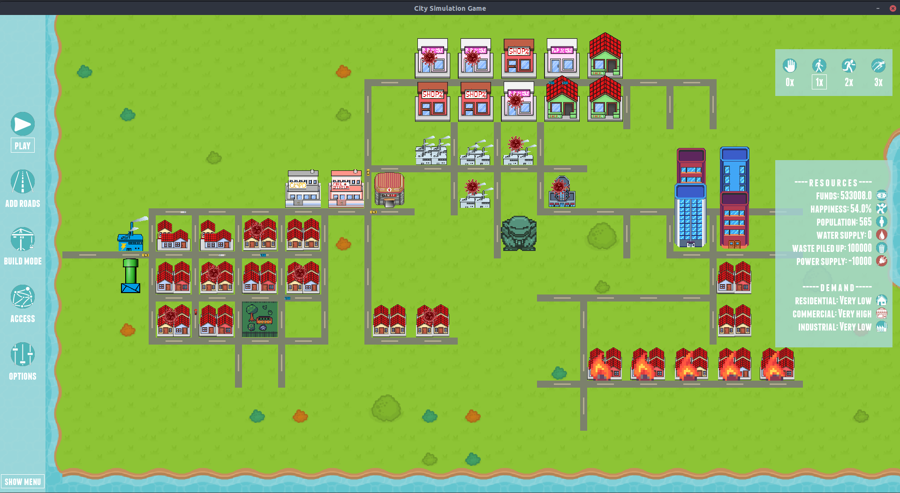
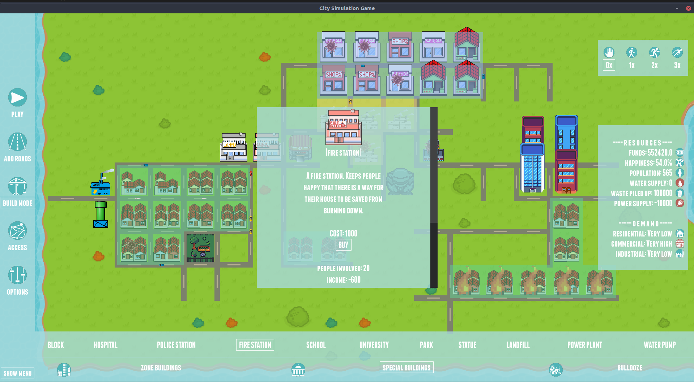

# City Simulation Game

## Table of Contents
- [City Simulation Game](#city-simulation-game)
  - [Table of Contents](#table-of-contents)
  - [General Information](#general-information)
  - [Technologies Used](#technologies-used)
  - [Premise and Features](#premise-and-features)
  - [Screenshots](#screenshots)
  - [Setup and run](#setup-and-run)
  - [Credits](#credits)

## General Information
Created as a project for a Python Programming class at the AGH UST, **City Simulation Game** (or **CSG** for short) is a 2D sandbox game that lets you design, build and manage your own city. 

## Technologies Used
- **Python - version 3.9.5**
- pygame - version 2.0.1
- pygame-menu - verson 4.1.0
- numpy - version 1.20.3

## Premise and Features
- Place residential, commercial and industrial buildings by drawing special zones.
- Buy other special buildings that affect city's statistics such as residents' happiness or city resources.
- Add roads that connect constructs on the map and introduce traffic.
- Upgrade the infrastructure to increase city's wellbeing.
- Do your best to prevent unwanted events such as fires, burglaries or pandemics...
- Monitor your funds, city's population and current demand for construct types and utilities.
- Have fun with CSG's sandbox-type gameplay.

## Screenshots

## Setup and run
Run it via src/main.py file - to do so u have to meet some requirements.
All of them are listed in the requirements.txt file. You can download everything necessary by executing:
`pip install -r requirements.txt`. Run the game with `python src/main.py`.

<!-- ## Room for Improvement
*  -->

## Credits

Created by:
[@mhawryluk](https://www.github.com/mhawryluk) and [@Singularity23x0](https://www.github.com/Singularity23x0)

Game graphics created from modification of assets aquired at:
- https://opengameart.org/
